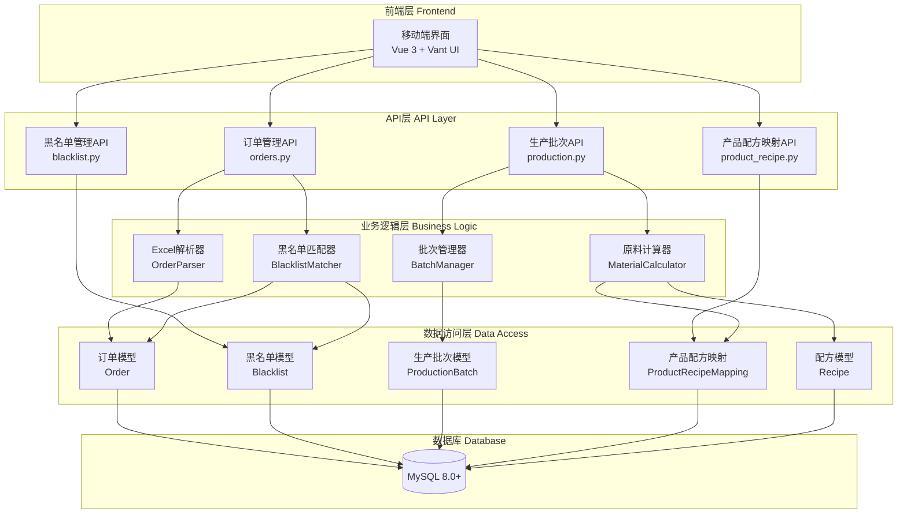
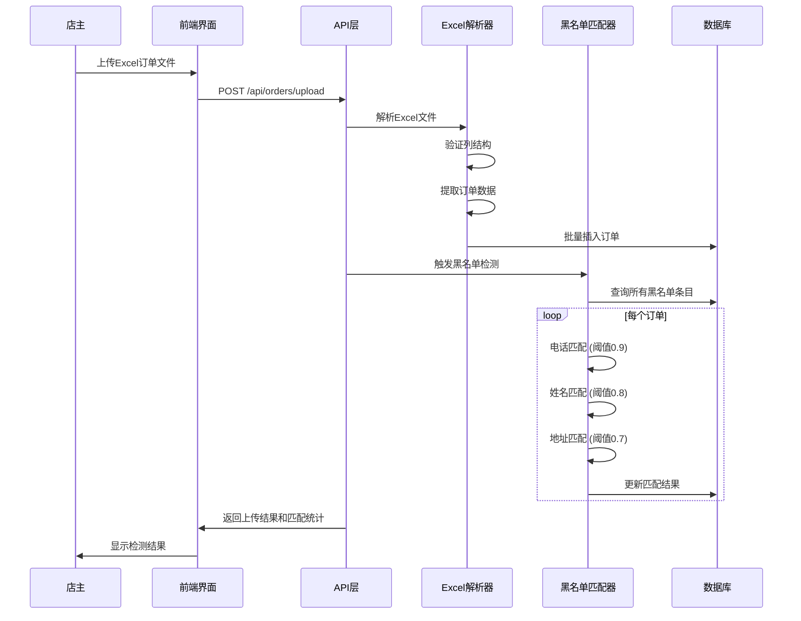
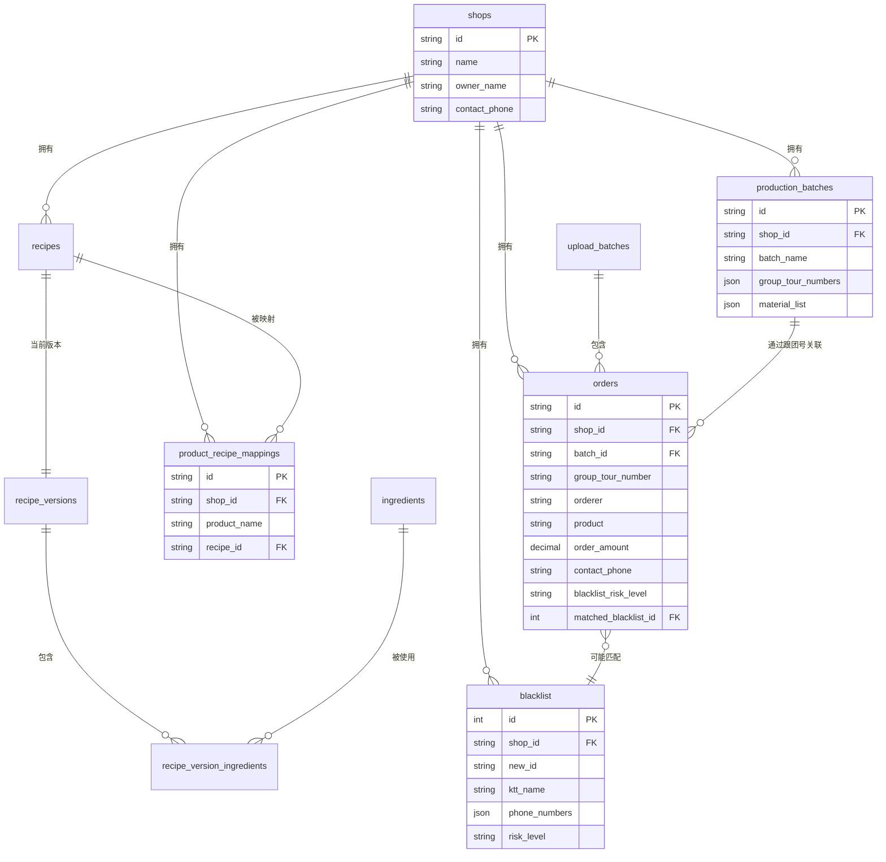

# 集成订单黑名单系统 - 设计文档

## 概述

本设计文档描述了将黑名单检测和订单管理系统集成到bakingRecipe应用中的技术方案。该系统旨在保护店主免受职业打假人的欺诈性退款请求，同时自动化生产批次的原料计算过程。

### 核心功能

1. **Excel订单文件解析**：上传并解析包含13个必需列的订单Excel文件
2. **自动黑名单检测**：使用模糊匹配算法（电话、姓名、地址）自动识别可疑订单
3. **黑名单管理**：增删改黑名单条目，维护欺诈买家数据库
4. **产品配方关联**：建立产品名称与配方的映射关系
5. **生产批次管理**：选择跟团号创建生产批次
6. **原料需求计算**：基于配方自动计算生产批次所需的原料总量
7. **移动端优先界面**：响应式设计，支持320px-768px屏幕宽度

### 技术栈

- **后端**：Python 3.9+, FastAPI, SQLAlchemy
- **前端**：Vue 3, Vant UI (移动端组件库)
- **数据库**：MySQL 8.0+
- **文件处理**：openpyxl (Excel解析)
- **匹配算法**：difflib.SequenceMatcher (模糊匹配)

## 架构

### 系统架构图



### 数据流图



### 模块职责

#### 1. OrderParser (Excel解析器)
- 验证Excel文件列结构
- 解析订单数据并转换数据类型
- 提取电话号码
- 批量创建订单记录

#### 2. BlacklistMatcher (黑名单匹配器)
- 执行模糊匹配算法
- 计算相似度分数
- 确定风险等级 (HIGH/MEDIUM/LOW)
- 记录匹配详情

#### 3. MaterialCalculator (原料计算器)
- 查询生产批次中的所有订单
- 通过产品配方映射获取配方
- 聚合原料需求
- 生成原料清单

#### 4. BatchManager (批次管理器)
- 创建和管理生产批次
- 关联跟团号
- 保存批次历史记录

## 组件和接口

### API端点

#### 订单管理 API

```python
# POST /api/orders/upload
# 上传Excel订单文件
Request:
  - file: MultipartFile (Excel文件)
  - shop_id: str (店铺ID)

Response:
  {
    "success": bool,
    "batch_id": str,
    "total_orders": int,
    "blacklist_matches": int,
    "high_risk_count": int,
    "medium_risk_count": int,
    "low_risk_count": int,
    "errors": List[str]
  }

# GET /api/orders
# 查询订单列表
Query Parameters:
  - shop_id: str (必需)
  - risk_level: str (可选: HIGH/MEDIUM/LOW)
  - is_blacklist_checked: str (可选: yes/no)
  - group_tour_number: str (可选)
  - page: int (默认1)
  - page_size: int (默认20)

Response:
  {
    "total": int,
    "page": int,
    "page_size": int,
    "items": List[OrderDetail]
  }

# GET /api/orders/{order_id}
# 获取订单详情
Response:
  {
    "id": str,
    "group_tour_number": str,
    "orderer": str,
    "product": str,
    "order_amount": Decimal,
    "contact_phone": str,
    "blacklist_risk_level": str,
    "blacklist_match_details": str,
    "matched_blacklist_entry": BlacklistDetail (如果匹配)
  }

# PATCH /api/orders/{order_id}/status
# 更新订单状态
Request:
  {
    "order_status": str  # PENDING/PAID/SHIPPED/DELIVERED/CANCELLED/REFUNDED
  }

Response:
  {
    "success": bool,
    "order": OrderDetail
  }
```

#### 黑名单管理 API

```python
# POST /api/blacklist
# 创建黑名单条目
Request:
  {
    "ktt_name": str,
    "wechat_name": str (可选),
    "wechat_id": str (可选),
    "order_name_phone": str,
    "order_address1": str (可选),
    "order_address2": str (可选),
    "blacklist_reason": str,
    "risk_level": str  # HIGH/MEDIUM/LOW
  }

Response:
  {
    "success": bool,
    "blacklist_entry": BlacklistDetail
  }

# GET /api/blacklist
# 查询黑名单列表
Query Parameters:
  - risk_level: str (可选)
  - search: str (可选，搜索姓名或电话)
  - page: int
  - page_size: int

# PUT /api/blacklist/{blacklist_id}
# 更新黑名单条目
Request: (同创建)

# DELETE /api/blacklist/{blacklist_id}
# 删除黑名单条目
```

#### 产品配方映射 API

```python
# POST /api/product-recipe-mappings
# 创建产品配方映射
Request:
  {
    "product_name": str,
    "recipe_id": str,
    "shop_id": str
  }

Response:
  {
    "success": bool,
    "mapping": ProductRecipeMappingDetail
  }

# GET /api/product-recipe-mappings
# 查询映射列表
Query Parameters:
  - shop_id: str (必需)

# GET /api/orders/unmapped-products
# 获取未映射的产品名称列表
Query Parameters:
  - shop_id: str (必需)

Response:
  {
    "unmapped_products": List[str]
  }
```

#### 生产批次 API

```python
# POST /api/production-batches
# 创建生产批次
Request:
  {
    "batch_name": str,
    "shop_id": str,
    "group_tour_numbers": List[str]
  }

Response:
  {
    "success": bool,
    "batch_id": str,
    "material_list": List[MaterialItem]
  }

MaterialItem:
  {
    "ingredient_name": str,
    "total_weight": Decimal,  # 克
    "unit": str
  }

# GET /api/production-batches
# 查询生产批次历史
Query Parameters:
  - shop_id: str (必需)
  - page: int
  - page_size: int

# GET /api/production-batches/{batch_id}
# 获取批次详情和原料清单

# GET /api/production-batches/{batch_id}/export
# 导出原料清单为Excel
Response: Excel文件下载
```

### 核心类和接口

#### OrderParser

```python
class OrderParser:
    """Excel订单文件解析器"""
    
    REQUIRED_COLUMNS = [
        "跟团号", "下单人", "团员备注", "支付时间", "团长备注",
        "商品", "订单金额", "退款金额", "订单状态", "自提点",
        "收货人", "联系电话", "详细地址"
    ]
    
    def validate_columns(self, df: pd.DataFrame) -> Tuple[bool, List[str]]:
        """验证Excel列结构"""
        pass
    
    def parse_excel(self, file_path: str) -> List[Dict]:
        """解析Excel文件为订单字典列表"""
        pass
    
    def parse_payment_time(self, value: Any) -> Optional[datetime]:
        """解析支付时间"""
        pass
    
    def parse_decimal(self, value: Any) -> Decimal:
        """解析金额字段"""
        pass
    
    def extract_phone(self, phone_str: str) -> Optional[str]:
        """提取电话号码"""
        pass
```

#### BlacklistMatcher

```python
class BlacklistMatcher:
    """黑名单匹配器"""
    
    PHONE_THRESHOLD = 0.9
    NAME_THRESHOLD = 0.8
    ADDRESS_THRESHOLD = 0.7
    
    def match_order(self, order: Order, blacklist_entries: List[Blacklist]) -> MatchResult:
        """匹配订单与黑名单"""
        pass
    
    def match_phone(self, order_phone: str, blacklist_phones: List[str]) -> Tuple[bool, float]:
        """电话匹配"""
        pass
    
    def match_name(self, order_name: str, blacklist_names: List[str]) -> Tuple[bool, float]:
        """姓名匹配"""
        pass
    
    def match_address(self, order_addr: str, blacklist_addrs: List[str]) -> Tuple[bool, float]:
        """地址匹配"""
        pass
    
    def normalize_text(self, text: str) -> str:
        """文本标准化（去除空格和特殊字符）"""
        pass
    
    def calculate_similarity(self, str1: str, str2: str) -> float:
        """计算字符串相似度"""
        pass
```

#### MaterialCalculator

```python
class MaterialCalculator:
    """原料需求计算器"""
    
    def calculate_batch_materials(
        self, 
        batch: ProductionBatch,
        db: Session
    ) -> List[MaterialItem]:
        """计算生产批次的原料需求"""
        pass
    
    def get_recipe_for_product(
        self, 
        product_name: str, 
        shop_id: str,
        db: Session
    ) -> Optional[Recipe]:
        """获取产品对应的配方"""
        pass
    
    def aggregate_ingredients(
        self, 
        recipes: List[Tuple[Recipe, int]]
    ) -> Dict[str, Decimal]:
        """聚合原料需求"""
        pass
```

## 数据模型

### 新增表结构

#### orders (订单表)

```sql
CREATE TABLE `orders` (
  `id` VARCHAR(36) PRIMARY KEY COMMENT '订单ID',
  `shop_id` VARCHAR(36) NOT NULL COMMENT '店铺ID',
  `batch_id` VARCHAR(36) COMMENT '上传批次ID',
  `group_tour_number` VARCHAR(100) COMMENT '跟团号',
  `orderer` VARCHAR(100) COMMENT '下单人',
  `member_remarks` TEXT COMMENT '团员备注',
  `payment_time` DATETIME COMMENT '支付时间',
  `group_leader_remarks` TEXT COMMENT '团长备注',
  `product` VARCHAR(200) COMMENT '商品',
  `order_amount` DECIMAL(10,2) COMMENT '订单金额',
  `refund_amount` DECIMAL(10,2) DEFAULT 0 COMMENT '退款金额',
  `order_status` ENUM('PENDING','PAID','SHIPPED','DELIVERED','CANCELLED','REFUNDED') 
    DEFAULT 'PENDING' COMMENT '订单状态',
  `pickup_point` VARCHAR(200) COMMENT '自提点',
  `consignee` VARCHAR(100) COMMENT '收货人',
  `contact_phone` VARCHAR(20) COMMENT '联系电话',
  `detailed_address` TEXT COMMENT '详细地址',
  `is_blacklist_checked` VARCHAR(10) DEFAULT 'no' COMMENT '是否已检测黑名单',
  `blacklist_risk_level` VARCHAR(20) COMMENT '黑名单风险等级',
  `blacklist_match_info` TEXT COMMENT '黑名单匹配信息',
  `blacklist_match_details` TEXT COMMENT '黑名单匹配详情',
  `matched_blacklist_id` INT COMMENT '匹配的黑名单ID',
  `created_at` TIMESTAMP DEFAULT CURRENT_TIMESTAMP,
  `updated_at` TIMESTAMP DEFAULT CURRENT_TIMESTAMP ON UPDATE CURRENT_TIMESTAMP,
  
  FOREIGN KEY (`shop_id`) REFERENCES `shops`(`id`),
  INDEX `idx_shop_id` (`shop_id`),
  INDEX `idx_batch_id` (`batch_id`),
  INDEX `idx_group_tour_number` (`group_tour_number`),
  INDEX `idx_orderer` (`orderer`),
  INDEX `idx_contact_phone` (`contact_phone`),
  INDEX `idx_order_status` (`order_status`),
  INDEX `idx_is_blacklist_checked` (`is_blacklist_checked`),
  INDEX `idx_blacklist_risk_level` (`blacklist_risk_level`)
) ENGINE=InnoDB DEFAULT CHARSET=utf8mb4 COMMENT='订单表';
```

#### blacklist (黑名单表)

```sql
CREATE TABLE `blacklist` (
  `id` INT AUTO_INCREMENT PRIMARY KEY COMMENT '黑名单ID',
  `shop_id` VARCHAR(36) NOT NULL COMMENT '店铺ID',
  `new_id` VARCHAR(10) UNIQUE COMMENT '10位唯一标识',
  `ktt_name` VARCHAR(100) COMMENT 'KTT名字',
  `wechat_name` VARCHAR(100) COMMENT '微信名字',
  `wechat_id` VARCHAR(100) COMMENT '微信号',
  `order_name_phone` TEXT COMMENT '下单名字和电话（原始）',
  `phone_numbers` JSON COMMENT '提取的电话号码列表',
  `order_address1` TEXT COMMENT '下单地址1',
  `order_address2` TEXT COMMENT '下单地址2',
  `blacklist_reason` TEXT COMMENT '入黑名单原因',
  `risk_level` ENUM('HIGH','MEDIUM','LOW') DEFAULT 'MEDIUM' COMMENT '风险等级',
  `created_by` VARCHAR(36) COMMENT '创建用户ID',
  `created_at` TIMESTAMP DEFAULT CURRENT_TIMESTAMP,
  `updated_at` TIMESTAMP DEFAULT CURRENT_TIMESTAMP ON UPDATE CURRENT_TIMESTAMP,
  
  FOREIGN KEY (`shop_id`) REFERENCES `shops`(`id`),
  INDEX `idx_shop_id` (`shop_id`),
  INDEX `idx_ktt_name` (`ktt_name`),
  INDEX `idx_phone_numbers` (`phone_numbers`(255)),
  INDEX `idx_risk_level` (`risk_level`)
) ENGINE=InnoDB DEFAULT CHARSET=utf8mb4 COMMENT='黑名单表';
```

#### product_recipe_mappings (产品配方映射表)

```sql
CREATE TABLE `product_recipe_mappings` (
  `id` VARCHAR(36) PRIMARY KEY COMMENT '映射ID',
  `shop_id` VARCHAR(36) NOT NULL COMMENT '店铺ID',
  `product_name` VARCHAR(200) NOT NULL COMMENT '产品名称',
  `recipe_id` VARCHAR(36) NOT NULL COMMENT '配方ID',
  `created_at` TIMESTAMP DEFAULT CURRENT_TIMESTAMP,
  `updated_at` TIMESTAMP DEFAULT CURRENT_TIMESTAMP ON UPDATE CURRENT_TIMESTAMP,
  
  FOREIGN KEY (`shop_id`) REFERENCES `shops`(`id`),
  FOREIGN KEY (`recipe_id`) REFERENCES `recipes`(`id`),
  UNIQUE KEY `uk_shop_product` (`shop_id`, `product_name`),
  INDEX `idx_recipe_id` (`recipe_id`)
) ENGINE=InnoDB DEFAULT CHARSET=utf8mb4 COMMENT='产品配方映射表';
```

#### production_batches (生产批次表)

```sql
CREATE TABLE `production_batches` (
  `id` VARCHAR(36) PRIMARY KEY COMMENT '批次ID',
  `shop_id` VARCHAR(36) NOT NULL COMMENT '店铺ID',
  `batch_name` VARCHAR(100) NOT NULL COMMENT '批次名称',
  `group_tour_numbers` JSON COMMENT '包含的跟团号列表',
  `material_list` JSON COMMENT '计算的原料清单',
  `total_orders` INT COMMENT '订单总数',
  `created_by` VARCHAR(36) COMMENT '创建用户ID',
  `created_at` TIMESTAMP DEFAULT CURRENT_TIMESTAMP,
  
  FOREIGN KEY (`shop_id`) REFERENCES `shops`(`id`),
  INDEX `idx_shop_id` (`shop_id`),
  INDEX `idx_created_at` (`created_at`)
) ENGINE=InnoDB DEFAULT CHARSET=utf8mb4 COMMENT='生产批次表';
```

#### upload_batches (上传批次表)

```sql
CREATE TABLE `upload_batches` (
  `id` VARCHAR(36) PRIMARY KEY COMMENT '批次ID',
  `shop_id` VARCHAR(36) NOT NULL COMMENT '店铺ID',
  `file_name` VARCHAR(255) COMMENT '文件名',
  `total_orders` INT COMMENT '订单总数',
  `blacklist_matches` INT COMMENT '黑名单匹配数',
  `high_risk_count` INT COMMENT '高风险数',
  `medium_risk_count` INT COMMENT '中风险数',
  `low_risk_count` INT COMMENT '低风险数',
  `uploaded_by` VARCHAR(36) COMMENT '上传用户ID',
  `created_at` TIMESTAMP DEFAULT CURRENT_TIMESTAMP,
  
  FOREIGN KEY (`shop_id`) REFERENCES `shops`(`id`),
  INDEX `idx_shop_id` (`shop_id`),
  INDEX `idx_created_at` (`created_at`)
) ENGINE=InnoDB DEFAULT CHARSET=utf8mb4 COMMENT='上传批次表';
```

### 数据模型关系图



