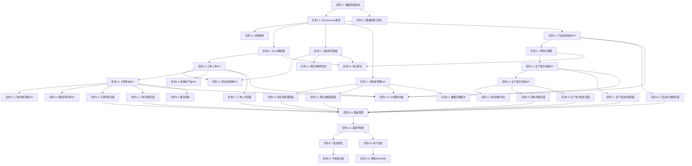

# 集成订单黑名单系统 - 任务列表

## 任务概述

本文档将集成订单黑名单系统的开发工作分解为可执行的任务。任务按照实施阶段和依赖关系组织，每个任务都有明确的验收标准。

## 实施策略

### 分阶段实施

1. **阶段1：数据库和核心模型** - 建立数据基础
2. **阶段2：订单管理和黑名单检测** - 实现核心业务逻辑
3. **阶段3：产品配方映射** - 连接订单与配方
4. **阶段4：生产批次和原料计算** - 实现自动化计算
5. **阶段5：移动端界面** - 提供用户交互界面
6. **阶段6：数据迁移和优化** - 迁移旧数据并优化性能

### 依赖关系

- 阶段2依赖阶段1
- 阶段3依赖阶段1和阶段2
- 阶段4依赖阶段1、阶段2和阶段3
- 阶段5可以与阶段2-4并行开发
- 阶段6在所有功能完成后执行

---

## 阶段1：数据库和核心模型

### 任务1.1：创建数据库表结构

**描述**：创建所有新增的数据库表，包括订单、黑名单、产品配方映射、生产批次和上传批次表。

**文件**：
- `bakingRecipe/database/order_blacklist_schema.sql`

**验收标准**：
- [ ] 创建 `orders` 表，包含所有必需字段和索引
- [ ] 创建 `blacklist` 表，包含JSON字段用于存储电话号码列表
- [ ] 创建 `product_recipe_mappings` 表，建立产品与配方的关联
- [ ] 创建 `production_batches` 表，存储生产批次信息
- [ ] 创建 `upload_batches` 表，记录Excel上传历史
- [ ] 所有外键约束正确设置
- [ ] 所有索引按设计文档创建
- [ ] 表字符集为 utf8mb4

### 任务1.2：创建SQLAlchemy数据模型

**描述**：在bakingRecipe后端创建对应的SQLAlchemy ORM模型。

**文件**：
- `bakingRecipe/backend/models.py` (扩展现有文件)

**验收标准**：
- [ ] 创建 `Order` 模型类，映射 orders 表
- [ ] 创建 `Blacklist` 模型类，映射 blacklist 表
- [ ] 创建 `ProductRecipeMapping` 模型类
- [ ] 创建 `ProductionBatch` 模型类
- [ ] 创建 `UploadBatch` 模型类
- [ ] 所有关系（relationships）正确定义
- [ ] JSON字段使用 `Column(JSON)` 类型
- [ ] 枚举类型（OrderStatus, RiskLevel）正确定义
- [ ] 所有索引通过 `__table_args__` 定义

### 任务1.3：创建数据库迁移脚本

**描述**：创建Python脚本用于初始化新表结构。

**文件**：
- `bakingRecipe/database/init_order_blacklist_tables.py`

**验收标准**：
- [ ] 脚本能够读取 SQL 文件并执行
- [ ] 脚本检查表是否已存在，避免重复创建
- [ ] 脚本提供清晰的执行日志
- [ ] 脚本能够回滚失败的操作
- [ ] 包含使用说明文档

---

## 阶段2：订单管理和黑名单检测

### 任务2.1：实现Excel解析器

**描述**：创建OrderParser类，用于解析Excel订单文件。

**文件**：
- `bakingRecipe/backend/services/order_parser.py` (新建)

**验收标准**：
- [ ] 实现 `validate_columns()` 方法，验证13个必需列
- [ ] 实现 `parse_excel()` 方法，使用 openpyxl 读取Excel
- [ ] 实现 `parse_payment_time()` 方法，支持多种日期格式
- [ ] 实现 `parse_decimal()` 方法，处理金额字段
- [ ] 实现 `extract_phone()` 方法，使用正则提取电话号码
- [ ] 处理空值和异常数据
- [ ] 返回详细的验证错误信息
- [ ] 单元测试覆盖率 > 80%

### 任务2.2：实现黑名单匹配器

**描述**：创建BlacklistMatcher类，实现模糊匹配算法。

**文件**：
- `bakingRecipe/backend/services/blacklist_matcher.py` (新建)

**验收标准**：
- [ ] 实现 `match_phone()` 方法，阈值0.9
- [ ] 实现 `match_name()` 方法，阈值0.8
- [ ] 实现 `match_address()` 方法，阈值0.7
- [ ] 实现 `normalize_text()` 方法，标准化中文文本
- [ ] 实现 `calculate_similarity()` 方法，使用 SequenceMatcher
- [ ] 实现 `match_order()` 方法，返回匹配结果和风险等级
- [ ] 优先级：电话 > 姓名 > 地址
- [ ] 记录匹配详情（匹配字段、相似度分数）
- [ ] 单元测试覆盖率 > 80%

### 任务2.3：实现订单上传API

**描述**：创建订单上传的API端点，集成Excel解析和黑名单检测。

**文件**：
- `bakingRecipe/backend/routers/orders.py` (新建)

**验收标准**：
- [ ] 实现 `POST /api/orders/upload` 端点
- [ ] 接收 multipart/form-data 文件上传
- [ ] 调用 OrderParser 解析Excel
- [ ] 批量插入订单到数据库
- [ ] 创建 UploadBatch 记录
- [ ] 触发黑名单检测（异步或同步）
- [ ] 返回上传统计信息
- [ ] 处理文件大小限制（最大10MB）
- [ ] 错误处理和日志记录
- [ ] API文档（OpenAPI/Swagger）

### 任务2.4：实现黑名单检测API

**描述**：创建黑名单检测的API端点。

**文件**：
- `bakingRecipe/backend/routers/orders.py` (扩展)

**验收标准**：
- [ ] 实现 `POST /api/orders/check-blacklist` 端点
- [ ] 支持批量检测（批次ID或订单ID列表）
- [ ] 调用 BlacklistMatcher 进行匹配
- [ ] 更新订单的黑名单检测字段
- [ ] 返回匹配统计和详情
- [ ] 支持重新检测已检测的订单
- [ ] 进度反馈（WebSocket或轮询）
- [ ] API文档

### 任务2.5：实现订单查询API

**描述**：创建订单列表和详情查询的API端点。

**文件**：
- `bakingRecipe/backend/routers/orders.py` (扩展)

**验收标准**：
- [ ] 实现 `GET /api/orders` 端点（列表查询）
- [ ] 支持分页（page, page_size）
- [ ] 支持按风险等级过滤
- [ ] 支持按跟团号过滤
- [ ] 支持按订单状态过滤
- [ ] 支持按是否检测过滤
- [ ] 实现 `GET /api/orders/{order_id}` 端点（详情）
- [ ] 返回关联的黑名单条目信息
- [ ] API文档

### 任务2.6：实现订单状态更新API

**描述**：创建更新订单状态的API端点。

**文件**：
- `bakingRecipe/backend/routers/orders.py` (扩展)

**验收标准**：
- [ ] 实现 `PATCH /api/orders/{order_id}/status` 端点
- [ ] 验证状态值（PENDING/PAID/SHIPPED/DELIVERED/CANCELLED/REFUNDED）
- [ ] 记录状态变更时间
- [ ] 当状态变为REFUNDED时，标记为需要黑名单审查
- [ ] 权限验证（仅店主可修改）
- [ ] API文档

### 任务2.7：实现黑名单管理API

**描述**：创建黑名单的增删改查API端点。

**文件**：
- `bakingRecipe/backend/routers/blacklist.py` (新建)

**验收标准**：
- [ ] 实现 `POST /api/blacklist` 端点（创建）
- [ ] 自动提取电话号码并存储为JSON数组
- [ ] 生成10位唯一标识（new_id）
- [ ] 实现 `GET /api/blacklist` 端点（列表查询）
- [ ] 支持按风险等级过滤
- [ ] 支持按姓名或电话搜索
- [ ] 支持分页
- [ ] 实现 `GET /api/blacklist/{blacklist_id}` 端点（详情）
- [ ] 实现 `PUT /api/blacklist/{blacklist_id}` 端点（更新）
- [ ] 实现 `DELETE /api/blacklist/{blacklist_id}` 端点（删除）
- [ ] 权限验证
- [ ] API文档

---

## 阶段3：产品配方映射

### 任务3.1：实现产品配方映射API

**描述**：创建产品与配方映射关系的API端点。

**文件**：
- `bakingRecipe/backend/routers/product_recipe.py` (新建)

**验收标准**：
- [ ] 实现 `POST /api/product-recipe-mappings` 端点（创建映射）
- [ ] 验证配方ID存在
- [ ] 确保同一店铺的产品名称唯一
- [ ] 实现 `GET /api/product-recipe-mappings` 端点（查询映射列表）
- [ ] 按店铺ID过滤
- [ ] 返回配方详情（关联查询）
- [ ] 实现 `PUT /api/product-recipe-mappings/{mapping_id}` 端点（更新）
- [ ] 实现 `DELETE /api/product-recipe-mappings/{mapping_id}` 端点（删除）
- [ ] API文档

### 任务3.2：实现未映射产品查询API

**描述**：创建查询未映射产品名称的API端点。

**文件**：
- `bakingRecipe/backend/routers/product_recipe.py` (扩展)

**验收标准**：
- [ ] 实现 `GET /api/orders/unmapped-products` 端点
- [ ] 从订单表中提取所有唯一产品名称
- [ ] 排除已有映射的产品
- [ ] 按店铺ID过滤
- [ ] 返回产品名称列表和每个产品的订单数量
- [ ] API文档

---

## 阶段4：生产批次和原料计算

### 任务4.1：实现原料计算器

**描述**：创建MaterialCalculator类，计算生产批次的原料需求。

**文件**：
- `bakingRecipe/backend/services/material_calculator.py` (新建)

**验收标准**：
- [ ] 实现 `calculate_batch_materials()` 方法
- [ ] 根据跟团号查询所有订单
- [ ] 通过产品配方映射获取配方
- [ ] 从 recipe_version_ingredients 获取原料清单
- [ ] 聚合相同原料的重量
- [ ] 处理未映射的产品（记录警告）
- [ ] 返回原料清单（ingredient_name, total_weight, unit）
- [ ] 保留2位小数
- [ ] 单元测试覆盖率 > 80%

### 任务4.2：实现生产批次创建API

**描述**：创建生产批次的API端点，集成原料计算。

**文件**：
- `bakingRecipe/backend/routers/production.py` (新建)

**验收标准**：
- [ ] 实现 `POST /api/production-batches` 端点
- [ ] 接收批次名称和跟团号列表
- [ ] 验证跟团号存在
- [ ] 调用 MaterialCalculator 计算原料
- [ ] 保存批次信息和原料清单（JSON格式）
- [ ] 记录订单总数
- [ ] 返回批次ID和原料清单
- [ ] 错误处理（未映射产品警告）
- [ ] API文档

### 任务4.3：实现生产批次查询API

**描述**：创建生产批次历史查询的API端点。

**文件**：
- `bakingRecipe/backend/routers/production.py` (扩展)

**验收标准**：
- [ ] 实现 `GET /api/production-batches` 端点（列表）
- [ ] 按店铺ID过滤
- [ ] 支持分页
- [ ] 按创建时间倒序排列
- [ ] 实现 `GET /api/production-batches/{batch_id}` 端点（详情）
- [ ] 返回完整的原料清单
- [ ] 返回跟团号列表
- [ ] 返回订单总数
- [ ] API文档

### 任务4.4：实现原料清单导出功能

**描述**：创建导出原料清单为Excel的功能。

**文件**：
- `bakingRecipe/backend/routers/production.py` (扩展)
- `bakingRecipe/backend/services/excel_exporter.py` (新建)

**验收标准**：
- [ ] 实现 `GET /api/production-batches/{batch_id}/export` 端点
- [ ] 使用 openpyxl 生成Excel文件
- [ ] Excel包含列：原料名称、总重量、单位
- [ ] 设置合适的列宽和样式
- [ ] 返回文件下载响应
- [ ] 文件名包含批次名称和日期
- [ ] API文档

### 任务4.5：实现跟团号选择辅助API

**描述**：创建辅助选择跟团号的API端点。

**文件**：
- `bakingRecipe/backend/routers/orders.py` (扩展)

**验收标准**：
- [ ] 实现 `GET /api/orders/group-tour-numbers` 端点
- [ ] 返回所有唯一的跟团号
- [ ] 每个跟团号显示订单数量
- [ ] 每个跟团号显示订单总金额
- [ ] 按店铺ID过滤
- [ ] 支持按日期范围过滤
- [ ] 标记已包含在生产批次中的跟团号
- [ ] API文档

---

## 阶段5：移动端界面

### 任务5.1：创建订单上传页面

**描述**：创建移动端订单Excel上传界面。

**文件**：
- `bakingRecipe/frontend/src/views/OrderUpload.vue` (新建)

**验收标准**：
- [ ] 使用 Vant UI 的 Uploader 组件
- [ ] 文件类型限制为 .xlsx, .xls
- [ ] 文件大小限制为 10MB
- [ ] 显示上传进度
- [ ] 上传成功后显示统计信息
- [ ] 显示黑名单匹配统计
- [ ] 错误提示（列缺失、格式错误等）
- [ ] 响应式布局（320px-768px）
- [ ] 触摸友好的按钮（44x44px）

### 任务5.2：创建订单列表页面

**描述**：创建移动端订单列表和筛选界面。

**文件**：
- `bakingRecipe/frontend/src/views/OrderList.vue` (新建)

**验收标准**：
- [ ] 使用 Vant UI 的 List 组件（下拉刷新、上拉加载）
- [ ] 卡片式布局显示订单
- [ ] 显示关键信息：跟团号、下单人、商品、金额、风险等级
- [ ] 风险等级用颜色标识（HIGH红色、MEDIUM橙色、LOW黄色）
- [ ] 筛选器：风险等级、订单状态、是否检测
- [ ] 搜索功能：按跟团号或下单人搜索
- [ ] 点击订单卡片进入详情页
- [ ] 响应式布局
- [ ] 加载状态和空状态提示

### 任务5.3：创建订单详情页面

**描述**：创建移动端订单详情界面。

**文件**：
- `bakingRecipe/frontend/src/views/OrderDetail.vue` (新建)

**验收标准**：
- [ ] 使用 Vant UI 的 Cell 组件展示字段
- [ ] 显示所有订单字段
- [ ] 如果匹配黑名单，显示匹配详情
- [ ] 显示匹配的黑名单条目信息
- [ ] 显示相似度分数和匹配字段
- [ ] 订单状态更新功能（下拉选择）
- [ ] 确认对话框
- [ ] 返回按钮
- [ ] 响应式布局

### 任务5.4：创建黑名单管理页面

**描述**：创建移动端黑名单列表和管理界面。

**文件**：
- `bakingRecipe/frontend/src/views/BlacklistManage.vue` (新建)

**验收标准**：
- [ ] 使用 Vant UI 的 List 组件
- [ ] 卡片式布局显示黑名单条目
- [ ] 显示：KTT名字、电话、风险等级、原因
- [ ] 搜索功能：按姓名或电话搜索
- [ ] 筛选器：按风险等级筛选
- [ ] 添加按钮（浮动按钮）
- [ ] 滑动删除功能
- [ ] 点击编辑功能
- [ ] 响应式布局

### 任务5.5：创建黑名单编辑页面

**描述**：创建移动端黑名单添加/编辑界面。

**文件**：
- `bakingRecipe/frontend/src/views/BlacklistEdit.vue` (新建)

**验收标准**：
- [ ] 使用 Vant UI 的 Form 组件
- [ ] 字段：KTT名字、微信名字、微信号、下单名字和电话、地址1、地址2、原因、风险等级
- [ ] 必填字段验证
- [ ] 电话号码格式验证
- [ ] 风险等级选择器（Picker）
- [ ] 保存按钮
- [ ] 取消按钮
- [ ] 成功/失败提示
- [ ] 响应式布局

### 任务5.6：创建产品配方映射页面

**描述**：创建移动端产品配方映射管理界面。

**文件**：
- `bakingRecipe/frontend/src/views/ProductRecipeMapping.vue` (新建)

**验收标准**：
- [ ] 显示已映射的产品列表
- [ ] 显示未映射的产品列表（高亮提示）
- [ ] 每个产品显示：产品名称、配方名称、订单数量
- [ ] 添加映射功能
- [ ] 产品名称输入或选择（从未映射列表）
- [ ] 配方选择器（Picker，从现有配方中选择）
- [ ] 编辑映射功能
- [ ] 删除映射功能（滑动删除）
- [ ] 响应式布局

### 任务5.7：创建生产批次创建页面

**描述**：创建移动端生产批次创建界面。

**文件**：
- `bakingRecipe/frontend/src/views/ProductionBatchCreate.vue` (新建)

**验收标准**：
- [ ] 批次名称输入框（默认：日期+批次）
- [ ] 显示所有可用的跟团号列表
- [ ] 每个跟团号显示：跟团号、订单数、总金额
- [ ] 多选功能（Checkbox）
- [ ] 全选/反选功能
- [ ] 已选跟团号统计
- [ ] 创建按钮
- [ ] 显示计算进度
- [ ] 成功后跳转到原料清单页面
- [ ] 响应式布局

### 任务5.8：创建原料清单页面

**描述**：创建移动端原料清单展示界面。

**文件**：
- `bakingRecipe/frontend/src/views/MaterialList.vue` (新建)

**验收标准**：
- [ ] 显示批次名称和创建时间
- [ ] 显示包含的跟团号数量和订单总数
- [ ] 原料清单表格
- [ ] 列：原料名称、总重量、单位
- [ ] 支持横向滚动
- [ ] 导出Excel按钮
- [ ] 下载功能
- [ ] 返回批次列表按钮
- [ ] 响应式布局

### 任务5.9：创建生产批次历史页面

**描述**：创建移动端生产批次历史列表界面。

**文件**：
- `bakingRecipe/frontend/src/views/ProductionBatchHistory.vue` (新建)

**验收标准**：
- [ ] 使用 Vant UI 的 List 组件
- [ ] 卡片式布局显示批次
- [ ] 显示：批次名称、创建时间、跟团号数量、订单总数
- [ ] 点击查看原料清单
- [ ] 下拉刷新
- [ ] 上拉加载更多
- [ ] 按时间倒序排列
- [ ] 响应式布局

### 任务5.10：更新路由配置

**描述**：在Vue Router中添加新页面的路由。

**文件**：
- `bakingRecipe/frontend/src/router/index.js` (扩展)

**验收标准**：
- [ ] 添加 `/orders/upload` 路由
- [ ] 添加 `/orders` 路由
- [ ] 添加 `/orders/:id` 路由
- [ ] 添加 `/blacklist` 路由
- [ ] 添加 `/blacklist/edit/:id?` 路由
- [ ] 添加 `/product-recipe-mapping` 路由
- [ ] 添加 `/production-batch/create` 路由
- [ ] 添加 `/production-batch/history` 路由
- [ ] 添加 `/production-batch/:id/materials` 路由
- [ ] 配置路由守卫（需要登录）
- [ ] 配置页面标题

### 任务5.11：更新底部导航栏

**描述**：在TabBar中添加新功能的入口。

**文件**：
- `bakingRecipe/frontend/src/components/TabBar.vue` (扩展)

**验收标准**：
- [ ] 添加"订单"标签页（图标+文字）
- [ ] 添加"黑名单"标签页
- [ ] 添加"生产"标签页
- [ ] 保持现有的"配方"和"我的"标签页
- [ ] 图标使用 Vant Icon 或自定义图标
- [ ] 激活状态高亮
- [ ] 响应式布局

### 任务5.12：创建API服务封装

**描述**：在前端封装所有API调用。

**文件**：
- `bakingRecipe/frontend/src/api/orders.js` (新建)
- `bakingRecipe/frontend/src/api/blacklist.js` (新建)
- `bakingRecipe/frontend/src/api/production.js` (新建)
- `bakingRecipe/frontend/src/api/productRecipe.js` (新建)

**验收标准**：
- [ ] 封装所有订单相关API
- [ ] 封装所有黑名单相关API
- [ ] 封装所有生产批次相关API
- [ ] 封装所有产品配方映射API
- [ ] 统一错误处理
- [ ] 统一请求拦截器（添加token）
- [ ] 统一响应拦截器（处理401等）
- [ ] 使用 axios 发送请求
- [ ] TypeScript类型定义（如果使用TS）

---

## 阶段6：数据迁移和优化

### 任务6.1：创建BlackNameList数据迁移脚本

**描述**：创建从旧BlackNameList系统迁移数据的脚本。

**文件**：
- `bakingRecipe/database/migrate_blacklist_data.py` (新建)

**验收标准**：
- [ ] 连接到BlackNameList的MySQL数据库
- [ ] 读取 blacklist 表的所有记录
- [ ] 映射字段到新的 bakingRecipe 黑名单表
- [ ] 转换 phone_numbers 为JSON格式
- [ ] 映射 risk_level 枚举值
- [ ] 批量插入到 bakingRecipe 数据库
- [ ] 处理重复数据（跳过或更新）
- [ ] 记录迁移日志
- [ ] 生成迁移报告（成功数、失败数、错误详情）
- [ ] 支持干运行模式（预览不执行）

### 任务6.2：性能优化 - 数据库索引

**描述**：优化数据库查询性能。

**文件**：
- `bakingRecipe/database/optimize_indexes.sql` (新建)

**验收标准**：
- [ ] 分析慢查询日志
- [ ] 为高频查询字段添加复合索引
- [ ] 为 orders 表添加 (shop_id, payment_time) 复合索引
- [ ] 为 orders 表添加 (shop_id, blacklist_risk_level) 复合索引
- [ ] 为 blacklist 表添加全文索引（如果需要）
- [ ] 验证索引效果（EXPLAIN分析）
- [ ] 文档说明每个索引的用途

### 任务6.3：性能优化 - 黑名单检测批处理

**描述**：优化黑名单检测性能，支持大批量订单。

**文件**：
- `bakingRecipe/backend/services/blacklist_matcher.py` (优化)

**验收标准**：
- [ ] 实现批处理逻辑（每批50个订单）
- [ ] 使用数据库连接池
- [ ] 减少数据库查询次数（预加载黑名单）
- [ ] 使用多线程或异步处理（可选）
- [ ] 添加进度回调机制
- [ ] 测试100订单 vs 100黑名单的性能（<10秒）
- [ ] 测试1000订单 vs 100黑名单的性能（<60秒）
- [ ] 性能测试报告

### 任务6.4：添加缓存机制

**描述**：为频繁查询的数据添加缓存。

**文件**：
- `bakingRecipe/backend/cache.py` (新建)
- 相关API文件（扩展）

**验收标准**：
- [ ] 集成 Redis 或内存缓存
- [ ] 缓存黑名单列表（TTL: 5分钟）
- [ ] 缓存产品配方映射（TTL: 10分钟）
- [ ] 缓存配方详情（TTL: 10分钟）
- [ ] 实现缓存失效机制（数据更新时清除）
- [ ] 缓存命中率监控
- [ ] 配置文件管理缓存参数

### 任务6.5：添加日志和监控

**描述**：完善系统日志和监控功能。

**文件**：
- `bakingRecipe/backend/logging_config.py` (新建)
- 所有服务文件（扩展）

**验收标准**：
- [ ] 配置结构化日志（JSON格式）
- [ ] 日志级别：DEBUG, INFO, WARNING, ERROR
- [ ] 记录关键操作：订单上传、黑名单检测、批次创建
- [ ] 记录性能指标：处理时间、匹配数量
- [ ] 记录错误堆栈
- [ ] 日志轮转配置（按日期或大小）
- [ ] 集成日志聚合工具（可选）

### 任务6.6：编写单元测试

**描述**：为核心业务逻辑编写单元测试。

**文件**：
- `bakingRecipe/backend/tests/test_order_parser.py` (新建)
- `bakingRecipe/backend/tests/test_blacklist_matcher.py` (新建)
- `bakingRecipe/backend/tests/test_material_calculator.py` (新建)

**验收标准**：
- [ ] OrderParser 测试覆盖率 > 80%
- [ ] BlacklistMatcher 测试覆盖率 > 80%
- [ ] MaterialCalculator 测试覆盖率 > 80%
- [ ] 测试正常场景
- [ ] 测试边界条件
- [ ] 测试异常处理
- [ ] 使用 pytest 框架
- [ ] 使用 mock 隔离外部依赖
- [ ] CI/CD 集成（可选）

### 任务6.7：编写集成测试

**描述**：编写端到端的集成测试。

**文件**：
- `bakingRecipe/backend/tests/test_integration.py` (新建)

**验收标准**：
- [ ] 测试完整的订单上传流程
- [ ] 测试黑名单检测流程
- [ ] 测试生产批次创建流程
- [ ] 使用测试数据库
- [ ] 测试数据准备和清理
- [ ] 验证API响应格式
- [ ] 验证数据库状态
- [ ] 使用 pytest 框架

### 任务6.8：编写用户文档

**描述**：编写系统使用文档。

**文件**：
- `bakingRecipe/docs/ORDER_BLACKLIST_USER_GUIDE.md` (新建)

**验收标准**：
- [ ] 系统概述和功能介绍
- [ ] Excel文件格式说明（包含示例）
- [ ] 订单上传操作指南（截图）
- [ ] 黑名单管理操作指南
- [ ] 产品配方映射操作指南
- [ ] 生产批次创建操作指南
- [ ] 常见问题解答（FAQ）
- [ ] 错误信息说明
- [ ] 使用中文编写
- [ ] 包含移动端截图

### 任务6.9：编写开发者文档

**描述**：编写技术文档供开发者参考。

**文件**：
- `bakingRecipe/docs/ORDER_BLACKLIST_DEV_GUIDE.md` (新建)

**验收标准**：
- [ ] 系统架构说明
- [ ] 数据库设计说明
- [ ] API接口文档（或链接到Swagger）
- [ ] 核心算法说明（模糊匹配、原料计算）
- [ ] 部署指南
- [ ] 环境配置说明
- [ ] 依赖包说明
- [ ] 开发环境搭建
- [ ] 测试运行指南
- [ ] 使用中文编写

### 任务6.10：更新项目README

**描述**：更新项目README，添加新功能说明。

**文件**：
- `bakingRecipe/README.md` (扩展)

**验收标准**：
- [ ] 添加"订单黑名单系统"章节
- [ ] 功能特性列表
- [ ] 快速开始指南
- [ ] 链接到详细文档
- [ ] 更新技术栈说明
- [ ] 更新依赖安装说明
- [ ] 添加截图或演示视频链接
- [ ] 使用中文编写

---

## 任务依赖关系图

---

## 任务优先级

### P0 - 核心功能（必须完成）
- 任务1.1, 1.2, 1.3：数据库基础
- 任务2.1, 2.2, 2.3, 2.4：订单和黑名单核心
- 任务3.1：产品配方映射
- 任务4.1, 4.2：原料计算核心

### P1 - 重要功能（应该完成）
- 任务2.5, 2.6, 2.7：订单和黑名单管理
- 任务3.2：未映射产品查询
- 任务4.3, 4.4, 4.5：生产批次管理
- 任务5.1-5.12：所有前端界面

### P2 - 优化功能（可以延后）
- 任务6.1：数据迁移
- 任务6.2, 6.3, 6.4：性能优化
- 任务6.5：日志监控

### P3 - 质量保证（持续进行）
- 任务6.6, 6.7：测试
- 任务6.8, 6.9, 6.10：文档

---

## 预估工作量

| 阶段 | 任务数 | 预估天数 | 说明 |
|------|--------|----------|------|
| 阶段1 | 3 | 2天 | 数据库设计和模型创建 |
| 阶段2 | 7 | 5天 | 后端核心业务逻辑 |
| 阶段3 | 2 | 2天 | 产品配方映射 |
| 阶段4 | 5 | 4天 | 生产批次和原料计算 |
| 阶段5 | 12 | 8天 | 前端界面开发 |
| 阶段6 | 10 | 5天 | 优化、测试和文档 |
| **总计** | **39** | **26天** | 约5-6周（1人全职） |

---

## 下一步行动

1. **确认需求**：与用户确认需求文档和设计文档
2. **环境准备**：确保开发环境配置完成（Python、Node.js、MySQL、Redis等）
3. **开始阶段1**：从任务1.1开始，创建数据库表结构
4. **迭代开发**：按阶段顺序完成任务，每个阶段结束后进行测试
5. **持续集成**：前后端并行开发，定期集成测试

---

## 备注

- 本任务列表基于需求文档和设计文档创建
- 每个任务都有明确的验收标准
- 任务之间的依赖关系已标注
- 可根据实际情况调整任务优先级和工作量预估
- 建议使用项目管理工具（如Jira、Trello）跟踪任务进度
